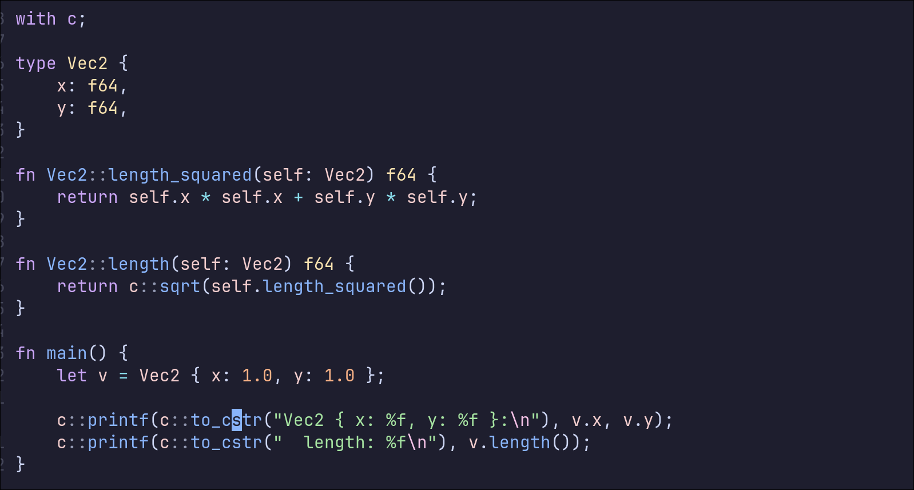

# cent.vim

Syntax highlighting for Cent programming language.



## Installation

[packer.nvim](https://github.com/wbthomason/packer.nvim):

```lua
use 'centlang/cent.vim'
```

[vim-plug](https://github.com/junegunn/vim-plug):

```vim
Plug 'centlang/cent.vim'
```

[vim.pack (Neovim 0.12)](https://neovim.io/doc/user/pack.html#vim.pack):

```lua
vim.pack.add({
    { src = 'https://github.com/centlang/cent.vim' },
})
```

[lazy.nvim](https://github.com/folke/lazy.nvim):

```lua
return {
    { "centlang/cent.vim", lazy = false },
}
```
